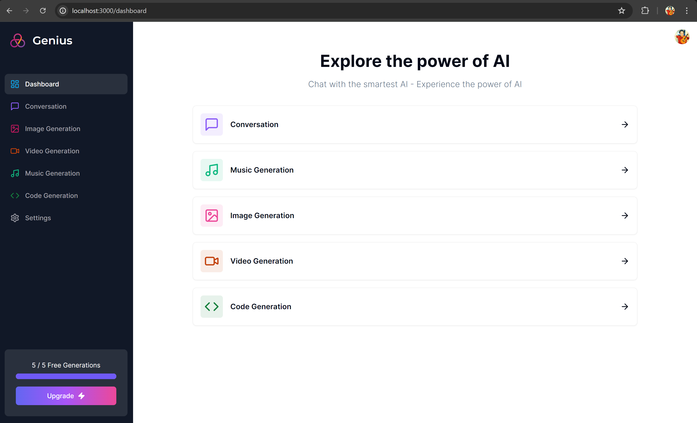
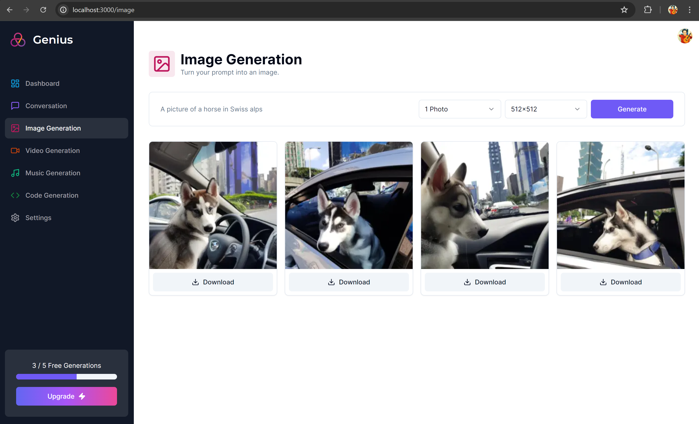
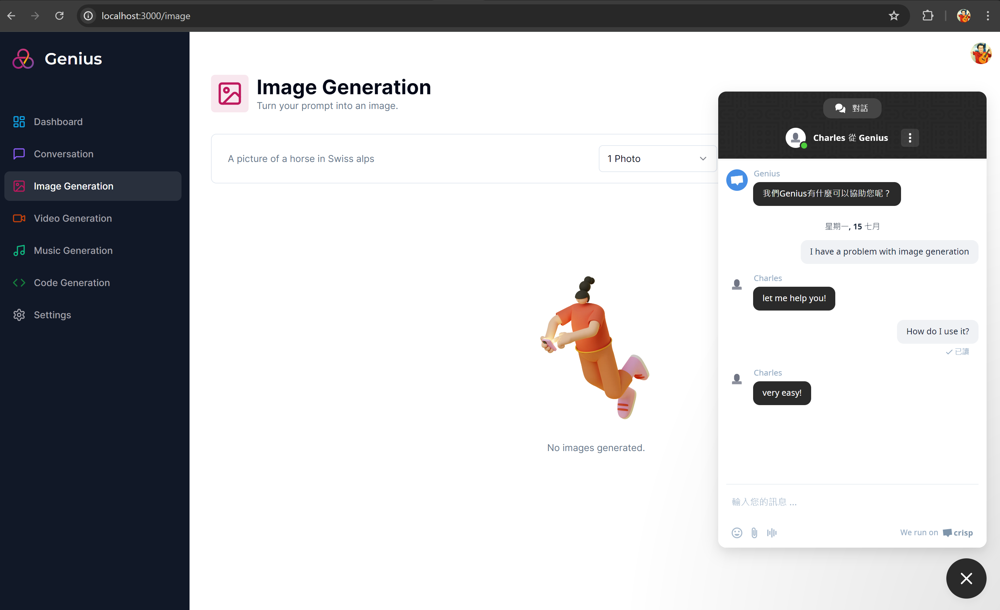

# Next.js

### Tutorial

https://www.codewithantonio.com/projects/ai-saas

### Tech Stack

- Tailwind
- React.js
- Next.js
- Prisma
- MySQL

### Web Services

- UI Components: Shadcn (https://ui.shadcn.com/)
- Authentication and User Management: [Clerk](https://clerk.com/)
- Conversation/Code AI: [OpenAI](https://openai.com/)
- Music/Video AI: [Replicate](https://replicate.com/)
- MySQL: [Aiven](https://aiven.io/)
- Payment: [Stripe](https://stripe.com/)
- Customer Support / Help Desk: [Crisp](https://crisp.chat/en/)

### Screenshots

