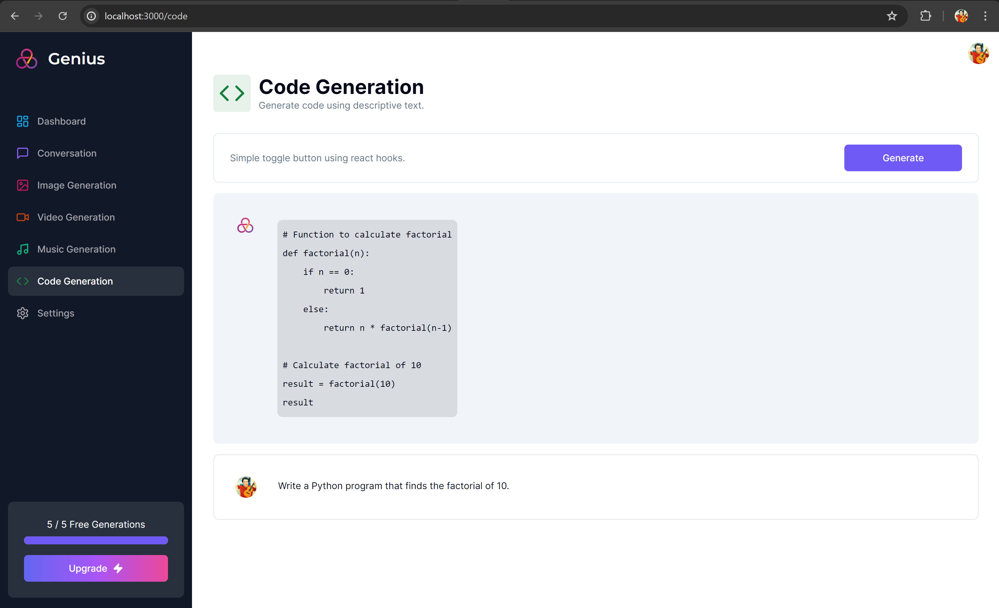

# Next.js

## AI-SaaS

### Tutorial

https://www.codewithantonio.com/projects/ai-saas

### Live Demo

https://ai-saas-charles.vercel.app/

### Tech Stack

- Tailwind
- React.js
- Next.js
- Prisma
- MySQL

### Web Services

- UI Components: [Shadcn](https://ui.shadcn.com/)
- Authentication and User Management: [Clerk](https://clerk.com/)
- Conversation/Code AI: [OpenAI](https://openai.com/)
- Music/Video AI: [Replicate](https://replicate.com/)
- MySQL: [Aiven](https://aiven.io/)
- Payment: [Stripe](https://stripe.com/)
- Customer Support / Help Desk: [Crisp](https://crisp.chat/en/)

### local development

- Stripe: 
`stripe login`
`stripe listen --forward-to localhost:3000/api/webhook`

- Prisma:
`npx prisma generate`
`npx prisma db push`
`npx prisma studio`

- Main: 
`npm run dev`

### Screenshots

## AI-Companion

### Tutorial

https://www.codewithantonio.com/projects/ai-companion

### Live Demo

https://ai-companion-charles.vercel.app/

### Tech Stack

- Tailwind
- React.js
- Next.js
- Prisma
- MySQL
- Upstash
- Pinecone

### Web Services

- UI Components: [Shadcn](https://ui.shadcn.com/)
- Authentication and User Management: [Clerk](https://clerk.com/)
- Conversation/Code AI: [OpenAI](https://openai.com/)
- Music/Video AI: [Replicate](https://replicate.com/)
- MySQL: [Aiven](https://aiven.io/)
- Payment: [Stripe](https://stripe.com/)
- Redis: [Upstash](https://upstash.com/)
- Vecter Database: [Pinecone](https://www.pinecone.io/)
- AI Image Generator: [Hotpot.ai](https://hotpot.ai/)
- Media Management: [Cloudinary](https://cloudinary.com/)

### Screenshots

